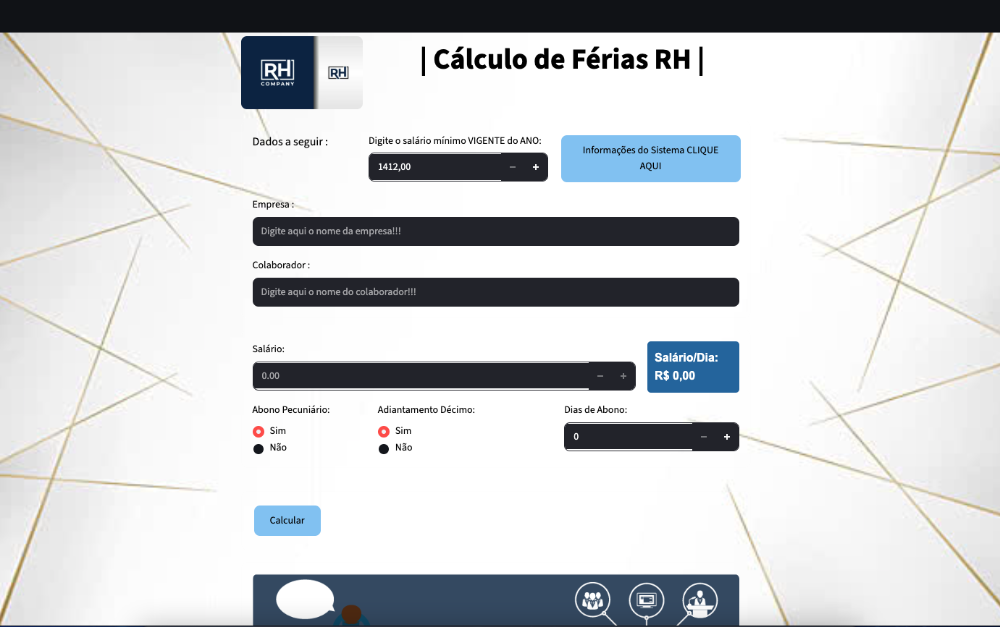

# 📊 Cálculo de Férias RH

Sistema web desenvolvido em **Python + Streamlit** para cálculo de férias trabalhistas, incluindo **abono pecuniário**, **adiantamento do 13º salário**, **cálculo de INSS**, visualização do recibo e geração de **PDF para impressão**.

O projeto foi criado com foco em simplicidade, usabilidade e automatização dos cálculos de férias para departamentos de Recursos Humanos, escritórios de contabilidade e estudos de desenvolvimento web com Streamlit.

---

## 📷 Demonstração



---

## 🚀 Funcionalidades

✅ Cadastro de Empresa e Colaborador

✅ Cálculo automático do salário por dia

✅ Cálculo de férias proporcionais

✅ Cálculo de 1/3 constitucional

✅ Cálculo de Abono Pecuniário (venda de férias)

✅ Cálculo de 1/3 sobre o abono

✅ Adiantamento da primeira parcela do 13º salário

✅ Desconto de INSS

✅ Exibição do recibo na tela

✅ Barra de progresso durante processamento

✅ Geração de recibo em PDF

✅ Download do PDF

✅ Interface amigável e responsiva

✅ Sistema de ajuda integrado

---

## 🛠️ Tecnologias Utilizadas

- Python 3.x
- Streamlit
- FPDF
- Locale
- Datetime
- IO

---

## 📂 Estrutura do Projeto

```text
calculo-ferias-rh/
│
├── assets/
│   ├── rh_logo.jpg
│   ├── receipt.jpg
│   └── rodape.png
│
├── docs/
│    └── preview.png
│
├── app.py
│
├── requirements.txt
│
├── README.md
│
└── .gitignore
```

---

## ⚙️ Instalação

### 1. Clonar o repositório

```bash
git clone https://github.com/MaiconDante/calcular_ferias_rh.git
```

### 2. Entrar na pasta

```bash
cd calculo-ferias-rh
```

### 3. Criar ambiente virtual

Windows:

```bash
python -m venv venv
```

Ativar:

```bash
venv\Scripts\activate
```

Linux/Mac:

```bash
python3 -m venv venv
source venv/bin/activate
```

### 4. Instalar dependências

```bash
pip install -r requirements.txt
```

---

## ▶️ Executando o Projeto

```bash
streamlit run main.py
```

Após executar, o navegador abrirá automaticamente:

```text
http://localhost:8501
```

---

## 📦 Dependências

Exemplo de arquivo requirements.txt

```text
streamlit
fpdf
```

Ou instale manualmente:

```bash
pip install streamlit fpdf
```

---

## 🧮 Como Funciona o Cálculo

### Férias

```python
dias_ferias = 30 - dias_abono
```

### Valor das Férias

```python
valor_ferias = dias_ferias * salario_dia
```

### 1/3 Constitucional

```python
um_terco = valor_ferias / 3
```

### Abono Pecuniário

```python
abono = dias_abono * salario_dia
```

### 1/3 do Abono

```python
um_terco_abono = abono / 3
```

### Adiantamento do 13º

```python
decimo = salario / 2
```

### Valor Final

```python
total = (
    valor_ferias
    + um_terco
    + abono
    + um_terco_abono
    + decimo
    - inss
)
```

---

## 📄 Geração de PDF

Após realizar os cálculos, o sistema permite gerar um recibo em PDF contendo:

- Data da emissão
- Empresa
- Colaborador
- Dias de férias
- Valor das férias
- 1/3 constitucional
- Abono pecuniário
- 1/3 do abono
- Adiantamento do 13º
- Desconto INSS
- Valor líquido

---

## 🎯 Objetivo do Projeto

Este projeto foi desenvolvido para:

- Praticar desenvolvimento web com Streamlit
- Automatizar cálculos trabalhistas
- Aprender geração de PDF com Python
- Trabalhar manipulação de estados com Streamlit
- Desenvolver interfaces amigáveis para usuários finais

---

## 👨‍💻 Autor

**Maicon Dante**

Analista de TI | Desenvolvedor Python | Entusiasta de Automação e Desenvolvimento Web.

### GitHub

https://github.com/MaiconDante

---

## 📚 Aprendizados

Durante o desenvolvimento deste projeto foram praticados conceitos como:

- Streamlit Layouts
- Containers
- Columns
- Session State
- CSS Customizado
- Manipulação de Arquivos
- Geração de PDF
- Validação de Dados
- Funções em Python
- Organização de Código
- UX para Sistemas Web

---

## 🤝 Contribuições

Contribuições são sempre bem-vindas.

Caso encontre algum problema ou tenha sugestões de melhorias:

1. Faça um Fork do projeto
2. Crie uma Branch

```bash
git checkout -b minha-melhoria
```

3. Faça suas alterações

```bash
git commit -m "feat: minha melhoria"
```

4. Envie para seu Fork

```bash
git push origin minha-melhoria
```

5. Abra um Pull Request

---

## 📜 Licença

Este projeto está licenciado sob a licença MIT.

```text
MIT License

Copyright (c) 2026 Maicon Dante

Permission is hereby granted, free of charge,
to any person obtaining a copy of this software
and associated documentation files.
```

---

⭐ Se este projeto foi útil para você, considere deixar uma estrela no repositório. Isso ajuda a apoiar o desenvolvimento e incentiva novas melhorias.
